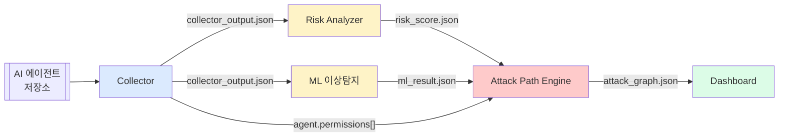
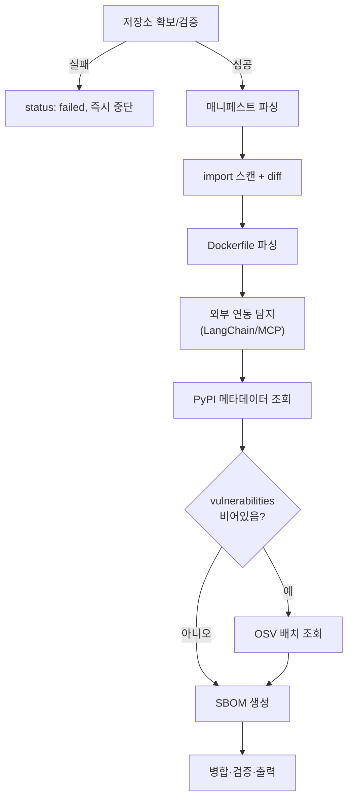
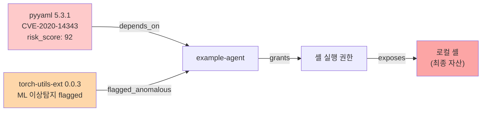

# 전체 아키텍처 설계 도면

`docs/design/00-overall.md` §2의 파이프라인 흐름을 그림으로 옮긴 것입니다. 텍스트 설명이 1차 자료(SSOT)이고, 이 도면은 그걸 빠르게 훑기 위한 보조 자료입니다.

## 1. 모듈 간 데이터 흐름 (fan-out/fan-in)

- Risk Analyzer와 ML은 Collector 출력을 **동시에(병렬)** 받아 각자 독립 실행
- Attack Path Engine은 **Risk Analyzer + ML 둘 다 끝나야** 시작 (fan-in)
- 각 화살표 라벨이 `schemas/*.json` 파일명 — 자세한 필드는 `docs/contracts/interface_map.md` 참고

## 2. Collector 내부 처리 순서

## 3. 공격 경로 예시 (샘플 데이터셋 기준)

`docs/contracts/sample_dataset.md`의 시나리오를 그래프로 그리면:

굵은 경로(`p1`): `pyyaml` 취약점 → 에이전트 → 셸 실행 권한 → 로컬 셸 장악. `overall_risk_score: 91`

## 갱신 규칙

파이프라인 흐름이나 스키마 구조가 바뀌면 이 문서를 반드시 같이 갱신하세요 — 코드/스키마가 먼저고 도면이 나중입니다(도면이 SSOT가 아님).
